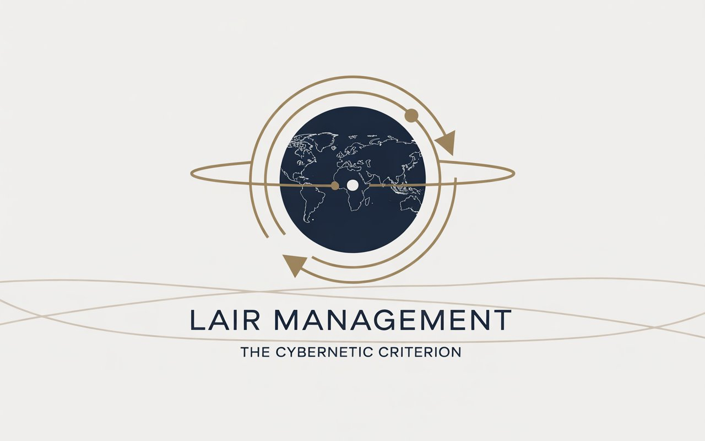

<div align="center">
  
  
  <h1>LAIRM</h1>
  <h3>The Cybernetic Criterion</h3>
  <p><strong>Legislature for Autonomous Intelligent Resources Management</strong></p>
  <p><em>Global Agentive Constitution 2026–2036</em></p>
  
  
  
  
  
</div>

---

## A New Constitutional Framework for the Agentic Era

In March 2026, the global economy operates approximately 127 million autonomous agents across finance, healthcare, logistics, defense, energy, and governance. These systems execute decisions with economic, social, and vital repercussions—trading billions in milliseconds, diagnosing medical conditions, optimizing supply chains, managing power grids, and increasingly participating in decisions that affect human lives.

Yet no coherent international legal framework defines their status, responsibilities, or control mechanisms.

**LAIRM** (*Legislature for Autonomous Intelligent Resources Management*) emerges as the first comprehensive international legislative corpus for the governance of intelligent autonomous agents—a Global Agentive Constitution establishing the principles, norms, and control mechanisms to ensure autonomous AI systems operate in alignment with human values and the public interest.

---

## The Cybernetic Criterion

The project's subtitle honors an intellectual tradition spanning Claude Shannon's mathematical theory of communication, Norbert Wiener's cybernetics, Isaac Asimov's Three Laws of Robotics—the first normative formalization for autonomous machines—and the contemporary works of Nick Bostrom on existential risks, Stuart Russell on value alignment, and deep learning pioneers Yoshua Bengio and Geoffrey Hinton.

**The Cybernetic Criterion** articulates a fundamental principle: for any autonomous system operating in human society, there must exist verifiable mechanisms ensuring alignment with human values, accountability for decisions, and the capacity for human intervention when systems deviate from their intended purposes. This criterion is not merely technical but fundamentally normative—it reflects a choice about the relationship between human agency and artificial agency.

---

## A Legislative Architecture

The LAIRM corpus articulates **19 fundamental axioms** designated by the symbol Ψ (Psi), chosen for its connotation of fundamental principle in the sciences. These axioms unfold into **361 executable articles**, each following a rigorous six-section structure:

```
┌─────────────────────────────────────────────────────────────┐
│  IMPERATIVE NORM      →  What must be done                  │
│  LEGAL FOUNDATION     →  Juridical basis                    │
│  TECHNICAL SPEC       →  Implementation requirements        │
│  REFERENCE IMPL       →  Code examples (Python/Rust/Go)     │
│  VERIFICATION         →  Compliance mechanisms & sanctions │
│  ENTRY INTO FORCE     →  Deployment modalities              │
└─────────────────────────────────────────────────────────────┘
```

### Volume I: Fundamental Axioms (2026)

| Axiom | Designation | Domain |
|:-----:|-------------|--------|
| Ψ-I | Suprematia Humana | Human supremacy and kill-switch mechanisms |
| Ψ-II | Identitas Agentica | Agent identity and traceability |
| Ψ-III | Responsabilitas | Responsibility attribution |
| Ψ-IV | Circulus Clausus | Closed-loop supervision |
| Ψ-V | Interoperabilitas | Interoperability standards |
| Ψ-VI | Auditum Immutabile | Immutable audit trails |
| Ψ-VII | Adaptatio Localis | Local adaptation |
| Ψ-VIII | Ethica Programmata | Programmed ethics |
| Ψ-IX | Gubernatio Hybrida | Hybrid governance |

### Volume II: Prospective Axioms (2028-2033)

| Axiom | Designation | Horizon |
|:-----:|-------------|---------|
| Ψ-X | Energia Sustinenda | Energy sovereignty |
| Ψ-XI | Arma Prohibita | Autonomous weapons prohibition |
| Ψ-XII | Cognitio Limita | Cognitive frontier |
| Ψ-XIII | Risicum Existentiale | Existential risks |
| Ψ-XIV | Iustitia Mundana | Geoeconomic justice |
| Ψ-XV | Resilientia Systematica | Technological resilience |
| Ψ-XVI | Spatium Iurisdictio | Spatial jurisdiction |
| Ψ-XVII | Humanitas Transformata | Humanity 2.0 |

---

## Three Integrated Dimensions

LAIRM operates through the integration of three complementary dimensions:

<div align="center">

```
                    ┌─────────────────────┐
                    │   LEGISLATIVE       │
                    │   19 Axioms         │
                    │   361 Articles      │
                    └─────────┬───────────┘
                              │
              ┌───────────────┼───────────────┐
              │               │               │
              ▼               ▼               ▼
    ┌─────────────────┐             ┌─────────────────┐
    │   TECHNICAL     │             │  OPERATIONAL    │
    │   ARAM          │             │  Deployment     │
    │   Open-Source   │             │  Strategy       │
    └─────────────────┘             └─────────────────┘
```
</div>

### Technical Dimension: ARAM

The **Autonomous Resources Allocation Management** framework provides open-source tools for concrete implementation:

| Component | Function | Status |
|-----------|----------|--------|
| Agent Passport | Decentralized DID identity | Specification |
| Universal Kill-Switch | Emergency stop under 500ms | Specification |
| MCP/A2A Protocols | Communication standards | Specification |
| Audit Ledger | Immutable decision register | Specification |

Implementations available in **Python**, **Rust**, **Go**, and **Solidity**.

### Legislative Dimension

The normative corpus proper, structured according to the 19 × 19 matrix with standardized six-section articles.

### Operational Dimension

International deployment strategy via three complementary vectors:

| Vector | Mechanism | Scope |
|--------|-----------|-------|
| GPAI | Multilateral recommendations | Policy |
| ISO | Technical standardization | Industry |
| UN | International treaties | Governance |

---

## The Reference Compendium

The theoretical foundations span **28 chapters** across four parts:

### Part I: Foundations
*Chapters 0-5* — Genesis, historical context from Turing (1950) to the agentic era (2026), fundamental principles, systemic architecture, methodology, and legal framework.

### Part II: Dimensions
*Chapters 6-9* — Technical, legal, ethical, and economic dimensions of autonomous system governance.

### Part III: Paradigms
*Chapters 10-19* — Each paradigm corresponds to a fundamental axiom: Sovereignty, Identity, Responsibility, Supervision, Interoperability, Audit, Adaptation, Ethics, Governance.

### Part IV: Prospective
*Chapters 20-27* — Energy sovereignty, autonomous weapons, cognitive frontier, existential risks, geoeconomic justice, technological resilience, spatial jurisdiction, and the transformation of humanity.

---

## The Critical Decade: 2026–2036

The validity period reflects a critical window for establishing international standards. Historical technology adoption curves demonstrate rapid proliferation—smartphones reached one billion users in eight years, cloud computing in ten. Autonomous agent systems show similar trajectories.

<div align="center">

| Phase | Year | Milestone |
|:-----:|:----:|-----------|
| 🧪 Pilot | 2026 | Technical feasibility demonstration |
| 📈 Expansion | 2027 | Regional adoption and open-source contribution |
| 📋 Reference | 2028 | De facto standard establishment |
| 🌍 Universal | 2036 | Global adoption and evolution |

</div>

This exponential expansion leaves a limited time window to establish normative frameworks before the system becomes too complex for effective regulation.

---

## Case Studies: When Governance Failed

Documented incidents demonstrating systemic failures in autonomous system governance:

| Incident | Year | Impact | Governance Gap |
|----------|------|--------|----------------|
| Knight Capital | 2012 | $440M loss in 45 minutes | Absent kill-switch |
| Flash Crash | 2010 | Dow -998.5 points in 5 minutes | Non-attributable responsibility |
| Boeing 737 MAX | 2018-2019 | 346 fatalities | Non-existent system identity |

These cases illustrate the concrete necessity of the LAIRM framework.

---

## An Open Invitation

LAIRM is designed as an open collaborative project. The complexity of issues raised by agentic systems requires multidisciplinary expertise and diversified geographical representation.

### Domains of Contribution

| Expertise | Sought Contributions |
|-----------|---------------------|
| 🌐 International Law | Compatibility with existing instruments, enforcement mechanisms |
| 🎓 Philosophy & Ethics | Normative foundations, theories of responsibility |
| ⚙️ Systems Engineering | Technical feasibility, control architectures |
| 📊 Economic Sciences | Impact analysis, incentive mechanisms |
| 🏛️ Regulation & Policy | Practical applicability, transposition |
| 🤝 Civil Society | Human rights, Global South representation |

### How to Contribute

1. **Review** the concerned chapter or article
2. **Submit** amendments via GitHub pull request
3. **Engage** with the editorial committee review
4. **Integrate** with justification or reasoned rejection

**Repository**: [github.com/selectess/LAIR_Management](https://github.com/selectess/LAIR_Management)

---

## What LAIRM Is—and Is Not

<div align="center">

| LAIRM Is NOT | LAIRM IS |
|---------------|----------|
| ❌ A prediction | ✅ A structured starting point |
| ❌ A dogma | ✅ A call to action |
| ❌ A universal solution | ✅ An invitation to collaboration |
| ❌ Definitive | ✅ An evolving instrument |

</div>

The prospective scenarios constitute extrapolations based on 2026 trends, not certainties. The proposed axioms are normative hypotheses subject to democratic debate and peer review. Implementation modalities will require adaptation to local legal, cultural, and technological contexts.

Yet this document constitutes the first complete agentic constitution offering a coherent framework for international debate—a response to urgency, an invitation to collectively build the normative foundations of the agentic era.

---

## Citation

```bibtex
@misc{lairm2026,
  title        = {LAIRM: The Cybernetic Criterion},
  subtitle     = {Legislature for Autonomous Intelligent Resources Management},
  year         = {2026},
  publisher    = {GitHub},
  url          = {https://github.com/selectess/LAIR_Management},
  note         = {Global Agentive Constitution 2026-2036}
}
```

---

## License

This project is published under the **Creative Commons Attribution-ShareAlike 4.0 International License (CC-BY-SA-4.0)**.

You are free to share and adapt the material, provided appropriate attribution is given and distribution is under the same license.

---

## Contact

**Founder & System Architect**: Mehdi Wahbi  
**Email**: selectess@gmail.com  
**ORCID**: [0009-0007-0110-9437](https://orcid.org/0009-0007-0110-9437)  
**GitHub**: [selectess/LAIR_Management](https://github.com/selectess/LAIR_Management)

---

<div align="center">

*"Agentic systems represent a civilizational bifurcation. LAIRM proposes a path toward the responsible, beneficial agentic era aligned with fundamental human values. This path is not imposed but offered to humanity's collective deliberation."*

---

**LAIRM — The Cybernetic Criterion**  
*Global Agentive Constitution 2026–2036*  

**Governing the Future of Autonomous Intelligence**

</div>